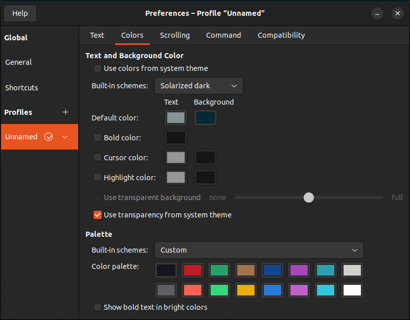

# Ferdy89 Dotfiles

Awesome for i3, Oh My Zsh, Tmux & Vim combo on Linux

## Installation

```bash
git clone https://github.com/Ferdy89/dotfiles.git && cd dotfiles

sudo apt install stow

stow zsh
stow bin
stow tmux
stow vim
stow i3
```

## Dependencies

i3, Neovim, and Tmux are necessary. These dotfiles are optimized to be used
with zsh and the oh-my-zsh package.

[The Silver Searcher](https://github.com/ggreer/the_silver_searcher#installing)
is recommended for searching in Vim.

## `bin` directory

The `bin` directory contains a set of executable scripts that the other tools
can use. The `zsh` configuration already adds this directory to the `PATH`.
Each script should be self-documented.

## Neovim

### Solarized theme

The Dark Solarized theme is installed from
https://github.com/altercation/vim-colors-solarized and directly copied to the
`~/.vim/colors/` per the installation instructions.

It should work beautifully when combined with the Dark Solarized theme in the
Ubuntu terminal:



## Opinionated features

* Move across tmux windows with C-h and C-l
* Move across vim tabs with C-j and C-k
* In tmux, the leader key is switched to C-s for convenience
* In vim, C-p fuzzy searches file names, :Ag searches file contents
* In vim, C-m shows the file tree structure, C-u shows git blame sidebar
* In tmux, use Leader | and Leader - to create vertical and horizontal splits

## TODOs

* Add my VSCode config
* Add instructions, installation scripts, and `zsh` files for
  * Ruby (`chruby` + `ruby-install`)
  * NodeJS (`NVM`)
  * Python (`pyenv`)
* Revitalize my Vim config files
  * Remove plugins
  * Remove unused stuff
  * Document as much as possible
* Remove i3 (or reword the README to explain I'm not using it anymore)
